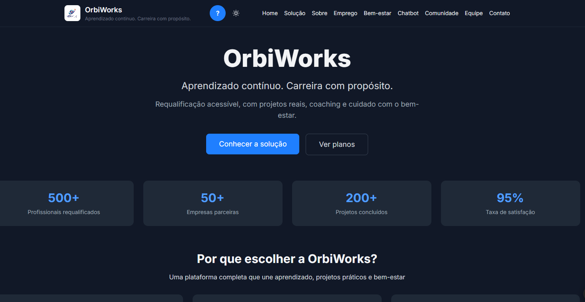
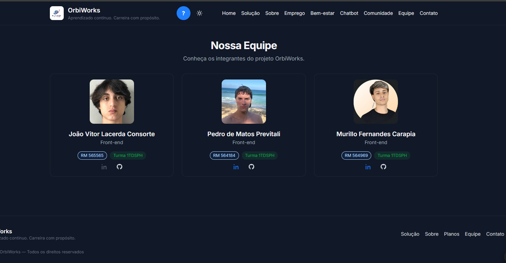
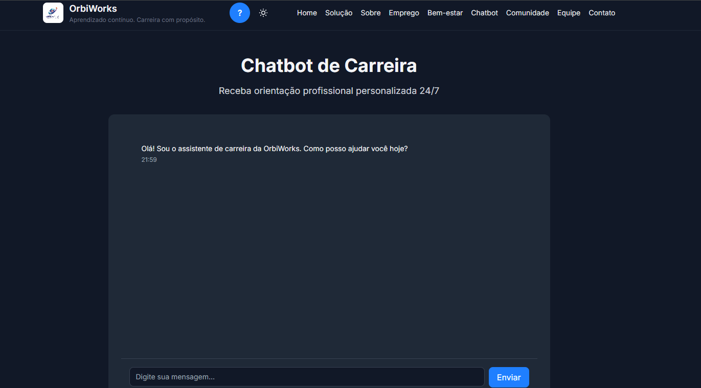
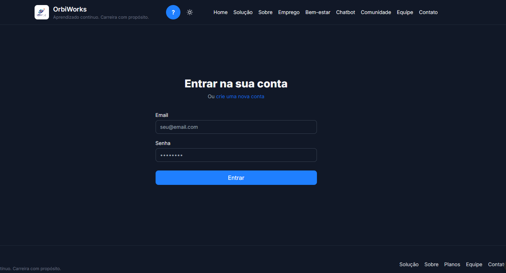
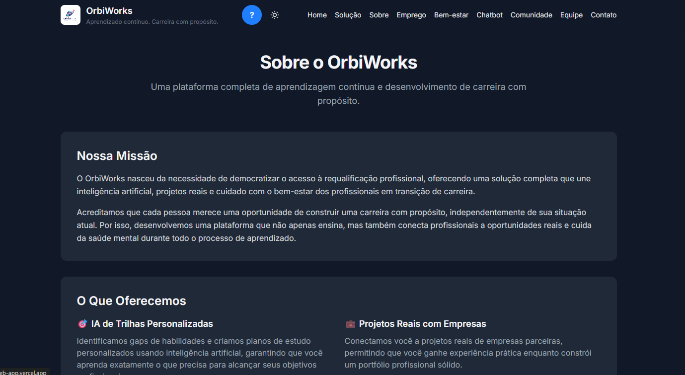

# OrbiWorks — Plataforma de Aprendizado Contínuo

## 📋 Descrição

A **OrbiWorks** é uma plataforma completa de aprendizagem contínua e desenvolvimento de carreira com propósito. Unimos inteligência artificial para trilhas personalizadas, mercado de projetos reais com empresas, coaching de carreira via chatbot, bem-estar e produtividade, além de comunidade e gamificação.

**Público-alvo:** Pessoas em transição de carreira (B2C) e empresas que requalificam times (B2B).  
**Alinhamento ODS:** 4, 8, 9 e 10.

---

## 🚀 Instalação e Execução

### Pré-requisitos

* Node.js 18+ (recomendado: Node.js 22.14.0)
* npm ou yarn

### Passos

1. **Clone o repositório**  
```bash
git clone https://github.com/Global-Solution-OrbiWorks/orbiworks-web-app.git
cd global_solution_orbi_works
```

2. **Instale as dependências**  
```bash
npm install
```

3. **Configure as variáveis de ambiente**  
Crie um arquivo `.env` na raiz do projeto:  
```env
VITE_API_URL=https://rm564969orbiworksgs.onrender.com
```

**Nota**: A API já está configurada por padrão. Você só precisa criar o `.env` se quiser usar uma URL diferente.

4. **Execute o projeto em desenvolvimento**  
```bash
npm run dev
```

5. **Acesse no navegador**  
```
http://localhost:5173
```

### Scripts Disponíveis

```bash
npm run dev         # Inicia servidor de desenvolvimento
npm run build       # Gera build de produção
npm run preview     # Preview do build de produção
npm run type-check  # Verifica erros de tipo TypeScript
npm test            # Executa testes (Vitest)
```

---

## 🔌 Integração com API

O projeto está integrado com uma API RESTful desenvolvida em Java seguindo Domain Driven Design (DDD), hospedada no Render. A comunicação é feita através de requisições HTTP usando `fetch` nativo do JavaScript, sem dependências externas como Axios.

### Configuração

A URL da API está configurada diretamente no código (`src/services/api.ts`) como `https://rm564969orbiworksgs.onrender.com`. Para usar uma URL diferente em desenvolvimento, você pode criar um arquivo `.env`:

```env
VITE_API_URL=https://rm564969orbiworksgs.onrender.com
```

### Uso dos Serviços de API

Os serviços estão centralizados em `src/services/api.ts` e podem ser importados em qualquer componente:

```typescript
import { findAllOrbiworks, findOrbiworksById, saveOrbiworks, updateOrbiworks, deleteOrbiworks } from './services/api'

// GET - Listar todos os registros
const registros = await findAllOrbiworks()

// GET - Buscar registro específico por código
const registro = await findOrbiworksById(1)

// POST - Criar novo registro
const novoRegistro = await saveOrbiworks({
  nome: 'João Silva',
  email: 'joao@example.com',
  telefone: '11999999999',
  senha: 'senha123'
})

// PUT - Atualizar registro existente
await updateOrbiworks(1, { nome: 'João Santos' })

// DELETE - Remover registro
await deleteOrbiworks(1)
```

### Endpoints Implementados

#### OrbiWorks (API Java - Render)

* `GET /orbiworks` - Lista todos os registros OrbiWorks
* `GET /orbiworks/:codigo` - Busca registro por ID (codigo)
* `POST /orbiworks` - Cria novo registro
* `PUT /orbiworks/:codigo` - Atualiza registro
* `DELETE /orbiworks/:codigo` - Deleta registro

#### Habilidades

* `GET /habilidades/cliente/:codCliente` - Busca habilidades por cliente
* `POST /habilidades` - Cria nova habilidade
* `PUT /habilidades/cliente/:codigo` - Atualiza habilidade
* `DELETE /habilidades/cliente/:codigo` - Deleta habilidade

#### Contato

* `POST /contato` - Envia mensagem de contato

**URL da API**: https://rm564969orbiworksgs.onrender.com

### Tratamento de Erros

O cliente API trata automaticamente:

* ✅ Timeouts de requisição
* ✅ Erros HTTP (400, 401, 404, 500, etc.)
* ✅ Erros de rede
* ✅ Erros de parsing JSON
* ✅ Fallback para mocks locais quando a API não está disponível

---

## 🔄 Como a API Funciona no Front-End

### Arquitetura de Comunicação

A aplicação utiliza uma arquitetura em camadas para comunicação com a API:

```
Páginas (UI) → Context API (Estado Global) → Services (API) → Backend Java
```

### Fluxo de Autenticação e Cadastro

#### 1. **Criação de Conta (Cadastro)**

Quando o usuário preenche o formulário em `/cadastro` e clica em "Criar conta":

1. **Página Cadastro.tsx** captura os dados do formulário via `handleSubmit`
2. Validação local dos campos obrigatórios (nome, email, senha)
3. Chamada ao `register()` do **AuthContext** passando os dados formatados
4. **AuthContext** faz requisição `POST /orbiworks` para a API Java
5. API retorna o usuário criado com `codigo` (ID)
6. **AuthContext** salva o usuário no estado e no `localStorage`
7. Redirecionamento automático para `/` após 2 segundos

**Código do fluxo:**
```typescript
// src/pages/Cadastro.tsx
const { register } = useAuth()

const handleSubmit = async (e: React.FormEvent) => {
  e.preventDefault()
  // Validação...
  await register(payload)  // Chama AuthContext
  navigate('/')  // Redireciona após sucesso
}

// src/context/AuthContext.tsx
const register = async (userData: Partial<Orbiworks>) => {
  const response = await fetch('https://rm564969orbiworksgs.onrender.com/orbiworks', {
    method: 'POST',
    headers: { 'Content-Type': 'application/json' },
    body: JSON.stringify(userData)
  })
  const newUser = await response.json()
  setUser(newUser)  // Atualiza estado global
  localStorage.setItem('user', JSON.stringify(newUser))  // Persiste
}
```

#### 2. **Login**

Quando o usuário faz login em `/login`:

1. **Página Login.tsx** captura email e senha
2. Chamada ao `login()` do **AuthContext**
3. **AuthContext** faz `GET /orbiworks` para buscar todos os usuários
4. Busca o usuário que corresponde ao email e senha informados
5. Se encontrado, salva no estado e `localStorage`
6. Redirecionamento para `/`

**Código do fluxo:**
```typescript
// src/pages/Login.tsx
const { login } = useAuth()

const handleSubmit = async (e: React.FormEvent) => {
  await login(email, senha)  // Chama AuthContext
  navigate('/')  // Redireciona após sucesso
}

// src/context/AuthContext.tsx
const login = async (email: string, senha: string) => {
  const response = await fetch('https://rm564969orbiworksgs.onrender.com/orbiworks')
  const users = await response.json()
  const foundUser = users.find(u => u.email === email && u.senha === senha)
  if (!foundUser) throw new Error('Email ou senha incorretos')
  setUser(foundUser)  // Atualiza estado global
}
```

#### 3. **Persistência de Sessão**

O **AuthContext** mantém o usuário logado através de:

- **Estado React**: `useState` armazena o usuário atual
- **localStorage**: Persiste o usuário entre recarregamentos da página
- **Inicialização**: Ao carregar a aplicação, verifica `localStorage` e restaura a sessão

```typescript
// src/context/AuthContext.tsx
const [user, setUser] = useState<Orbiworks | null>(() => {
  const stored = localStorage.getItem('user')
  return stored ? JSON.parse(stored) : null  // Restaura sessão
})

useEffect(() => {
  if (user) {
    localStorage.setItem('user', JSON.stringify(user))  // Salva mudanças
  } else {
    localStorage.removeItem('user')  // Remove ao fazer logout
  }
}, [user])
```

### Comunicação entre Páginas

#### Navegação com React Router

As páginas se comunicam através de:

1. **React Router DOM**: Gerencia rotas e navegação
2. **useNavigate**: Hook para navegação programática
3. **Link**: Componente para navegação declarativa

**Exemplo:**
```typescript
// Navegação após cadastro bem-sucedido
import { useNavigate } from 'react-router-dom'

const navigate = useNavigate()
await register(payload)
navigate('/')  // Redireciona para home
```

#### Compartilhamento de Estado (Context API)

O **AuthContext** fornece estado global para todas as páginas:

```typescript
// Qualquer página pode acessar o usuário logado
import { useAuth } from '../context/AuthContext'

function MinhaPage() {
  const { user, isAuthenticated, logout } = useAuth()
  
  if (!isAuthenticated) {
    return <div>Faça login para continuar</div>
  }
  
  return <div>Bem-vindo, {user?.nome}!</div>
}
```

### Fluxo de Dados Completo

#### Exemplo: Atualização de Perfil

1. Usuário acessa `/perfil`
2. Página verifica se está autenticado via `useAuth()`
3. Se não autenticado, redireciona para `/login`
4. Carrega dados do usuário via `findOrbiworksById(user.codigo)`
5. Preenche formulário com dados atuais
6. Ao salvar, chama `updateProfile()` do **AuthContext**
7. **AuthContext** faz `PUT /orbiworks/:codigo` para a API
8. Atualiza estado local e `localStorage`
9. Exibe mensagem de sucesso

**Código:**
```typescript
// src/pages/Perfil.tsx
const { user, updateProfile } = useAuth()

useEffect(() => {
  if (!user) navigate('/login')  // Proteção de rota
  // Carrega dados...
}, [user])

const handleSubmit = async () => {
  await updateProfile(formData)  // Atualiza via API
  setSuccess('Perfil atualizado com sucesso!')
}
```

### Serviços de API (Camada de Abstração)

O arquivo `src/services/api.ts` centraliza todas as chamadas HTTP:

**Vantagens:**
- Código reutilizável
- Tratamento de erros centralizado
- Fácil manutenção (mudar URL da API em um só lugar)
- Tipagem TypeScript para todas as respostas

**Estrutura:**
```typescript
// src/services/api.ts
const BASE_URL = 'https://rm564969orbiworksgs.onrender.com'

export async function findAllOrbiworks(): Promise<Orbiworks[]> {
  const response = await fetch(`${BASE_URL}/orbiworks`)
  if (!response.ok) throw new Error('Erro ao buscar registros')
  return await response.json()
}
```

### Proteção de Rotas

Páginas protegidas verificam autenticação:

```typescript
// src/pages/Perfil.tsx
useEffect(() => {
  if (!isAuthenticated || !user) {
    navigate('/login')
    return
  }
}, [user, isAuthenticated, navigate])
```

### Tratamento de Erros

Erros são tratados em múltiplas camadas:

1. **Services (api.ts)**: Captura erros HTTP e de rede
2. **Context (AuthContext)**: Trata erros de autenticação
3. **Páginas**: Exibe mensagens amigáveis ao usuário

```typescript
try {
  await login(email, senha)
  navigate('/')
} catch (err) {
  setError(err instanceof Error ? err.message : 'Erro ao fazer login')
  // Exibe mensagem de erro na UI
}
```

---

## 📁 Estrutura de Pastas

```
global_solution_orbi_works/
├── public/                    # Arquivos estáticos
│   ├── favicon.jpg
│   └── membros/              # Fotos dos integrantes
│       ├── membro1.png
│       ├── membro2.png
│       └── membro3.png
├── src/
│   ├── components/           # Componentes reutilizáveis
│   │   ├── Badge.tsx
│   │   ├── Button.tsx
│   │   ├── Card.tsx
│   │   ├── Footer.tsx
│   │   ├── Input.tsx
│   │   ├── MemberCard.tsx
│   │   ├── Navbar.tsx
│   │   ├── ThemeToggle.tsx
│   │   └── UserButton.tsx
│   ├── constants/            # Constantes
│   │   └── areas.ts
│   ├── context/              # Context API
│   │   ├── AuthContext.tsx
│   │   └── ThemeContext.tsx
│   ├── layouts/              # Layouts
│   │   └── MainLayout.tsx
│   ├── mocks/                # Dados mockados
│   │   ├── badges.ts
│   │   ├── index.ts
│   │   ├── persons.ts
│   │   ├── projects.ts
│   │   └── skills.ts
│   ├── pages/                # Páginas da aplicação
│   │   ├── Admin.tsx
│   │   ├── BemEstar.tsx
│   │   ├── Cadastro.tsx
│   │   ├── Chatbot.tsx
│   │   ├── Comunidade.tsx
│   │   ├── Contato.tsx
│   │   ├── Emprego.tsx
│   │   ├── Equipe.tsx
│   │   ├── Home.tsx
│   │   ├── Login.tsx
│   │   ├── NotFound.tsx
│   │   ├── Perfil.tsx
│   │   ├── Planos.tsx
│   │   └── Solucao.tsx
│   ├── services/             # Serviços de API
│   │   └── api.ts            # Cliente HTTP base (fetch nativo)
│   ├── types/                # Tipos TypeScript
│   │   ├── member.ts
│   │   ├── orbiworks.ts
│   │   └── projeto.ts
│   ├── utils/                # Utilitários
│   │   └── avatar.ts
│   ├── App.tsx               # Componente principal
│   ├── AppRouter.tsx         # Configuração de rotas
│   ├── index.css             # Estilos globais (TailwindCSS)
│   ├── main.tsx              # Entry point
│   └── vite-env.d.ts         # Tipos do Vite
├── .env                      # Variáveis de ambiente (não commitado)
├── .gitignore
├── index.html
├── package.json
├── postcss.config.cjs        # Configuração PostCSS/Tailwind
├── tailwind.config.cjs       # Configuração TailwindCSS
├── tsconfig.json             # Configuração TypeScript
├── vite.config.ts            # Configuração Vite
└── README.md                 # Este arquivo
```

---

## 🛣️ Rotas da Aplicação

| Rota | Descrição |
|------|-----------|
| `/` | Página inicial (Home) |
| `/solucao` | Visão geral da solução |
| `/planos` | Planos e preços |
| `/equipe` | Página da equipe (integrantes) |
| `/sobre` | Página sobre o projeto |
| `/contato` | Formulário de contato |
| `/bem-estar` | Bem-estar e produtividade |
| `/chatbot` | Chatbot de carreira |
| `/comunidade` | Comunidade e gamificação |
| `/login` | Página de login |
| `/cadastro` | Página de cadastro |
| `/perfil` | Perfil do usuário |
| `/emprego` | Área de empregos e habilidades |
| `*` | Página 404 (NotFound) |

---

## 👥 Integrantes

| Nome                         | RM     | Turma  | GitHub                                                                 |
| ---------------------------- | ------ | ------ | ---------------------------------------------------------------------- |
| **João Vitor Lacerda Consorte** | 565565 | 1TDSPH | [@joaoconsorte](https://github.com/joaolacerdaconsorte)                       |
| **Pedro de Matos Previtali** | 564184 | 1TDSPH | [@pedroprevitali](https://github.com/PedroPrevitali)                   |
| **Murillo Fernandes Carapia** | 564969 | 1TDSPH | [@murillocarapia](https://github.com/MurilloFernandesCarapia)                   |

### Fotos dos Integrantes

As fotos dos integrantes estão disponíveis na pasta `public/membros/` e são exibidas na página `/equipe` da aplicação.

---

## 🔗 Links Importantes

### Repositório

🔗 **GitHub**: https://github.com/Global-Solution-OrbiWorks/orbiworks-web-app

### Deploy

🌐 **Vercel**: https://orbiworks-web-app.vercel.app/

**URL da API**: https://rm564969orbiworksgs.onrender.com

### Vídeo de Apresentação

🎥 **YouTube**: https://www.youtube.com/watch?v=Mgpxrv49_cU

---

## 🎨 Design System

### Cores Principais

* **Primary (Azul)**: `#1f7fff` - Ações principais e links
* **Accent (Verde)**: `#22c55e` - Sucesso e confirmações
* **State Colors**:
  * Success: `#16a34a`
  * Warning: `#f59e0b`
  * Danger: `#ef4444`
  * Info: `#0ea5e9`

### Breakpoints (TailwindCSS)

* **XS**: `< 640px` - Mobile pequeno
* **SM**: `≥ 640px` - Mobile grande
* **MD**: `≥ 768px` - Tablet
* **LG**: `≥ 1024px` - Desktop
* **XL**: `≥ 1280px` - Desktop grande

### Tema Escuro/Claro

O projeto implementa tema escuro/claro usando:
* **Context API** (`ThemeContext.tsx`)
* **Tailwind CSS** com estratégia `class` (`darkMode: 'class'`)
* **Persistência** via `localStorage`
* **Preferência do sistema** como fallback

---

## 📝 TypeScript - Tipos Avançados

O projeto demonstra o uso de:

### Tipos Básicos

* `number`, `string`, `boolean`, `object`

### Union Types

```typescript
type Nivel = 'Beginner' | 'Intermediate' | 'Advanced'
type Area = 'frontend' | 'backend' | 'ml' | 'fullstack'
type Theme = 'light' | 'dark'
```

### Intersection Types

```typescript
type Member = MemberBase & MemberLinks
type Orbiworks = OrbiworksBase & OrbiworksMetadata
```

### Interfaces

```typescript
interface ApiResponse<T> {
  data?: T
  success?: boolean
  status?: number
  message?: string
}

interface Member {
  id: string
  name: string
  rm: string
  turma: string
  role?: string
  imageUrl?: string
  linkedin?: string
  github?: string
}
```

### Generics

```typescript
export async function findAllOrbiworks(): Promise<Orbiworks[]>
export async function findOrbiworksById(codigo: number): Promise<Orbiworks | null>
```

---

## 🛠️ Tecnologias Utilizadas

* **React 18.2.0** - Biblioteca JavaScript para interfaces
* **TypeScript 5.1.6** - Superset JavaScript com tipagem estática
* **Vite 5.1.0** - Build tool e dev server
* **Tailwind CSS 3.4.7** - Framework CSS utility-first
* **React Router DOM 6.14.1** - Roteamento para React
* **Vitest 0.34.1** - Framework de testes
* **Node.js >= 18** - Runtime JavaScript
* **npm >= 9** - Gerenciador de pacotes

---

## ✅ Funcionalidades Implementadas

* ✅ Tema escuro/claro com Context API e persistência
* ✅ Rotas estáticas e dinâmicas
* ✅ Página de Equipe completa com RM, Turma, GitHub e LinkedIn
* ✅ Integração com API Java remota (com fallback para mocks)
* ✅ Formulário de Contato com validação
* ✅ Página 404 (NotFound)
* ✅ Responsividade completa (mobile-first)
* ✅ Acessibilidade básica (ARIA labels, focus states)
* ✅ Autenticação e autorização (AuthContext)
* ✅ Gestão de habilidades e perfil profissional
* ✅ Chatbot de carreira
* ✅ Área de bem-estar e produtividade
* ✅ Comunidade e gamificação

---

## 📸 Screenshots / Demonstração

As capturas de tela das principais funcionalidades estão disponíveis na documentação visual do projeto, demonstrando a interface responsiva, tema escuro/claro, e as principais páginas da aplicação.
### Página Inicial


### Pagina da Equipe


### Pagina do ChatBot


### Pagina de Login Api


### Pagina Sobre

---

### Comandos Úteis

```bash
# Build local para testar
npm run build

# Preview da build
npm run preview

# Deploy via Vercel CLI (se instalado)
vercel
```

---

## 🙏 Agradecimentos

* FIAP - Faculdade de Informática e Administração Paulista
* Professor Alexandre Carlos de Jesus [@alecarlosjesus](https://github.com/alecarlosjesus)

---

**Desenvolvido com ❤️ pela equipe OrbiWorks**

🎓 **OrbiWorks** - Aprendizado contínuo. Carreira com propósito.

---


> [!WARNING]
> **Nota sobre Segurança e Criptografia**
>
> Este projeto optou por não utilizar **Hashing** para criptografia de senhas na API de Cadastro e Login.
>
> Reconhecemos que esta prática não é adequada para ambientes de produção e fere princípios de Proteção de Dados. No entanto, como este é um MVP acadêmico para a **Global Solution (FIAP)** e o foco atual do aprendizado está na integração entre Front-end e Back-end, mantivemos os dados em texto plano para viabilizar a entrega dentro do prazo e escopo técnico atuais.

Este projeto foi desenvolvido para fins acadêmicos como parte da disciplina **Global Solution** da FIAP.

© 2025 OrbiWorks — Todos os direitos reservados.
